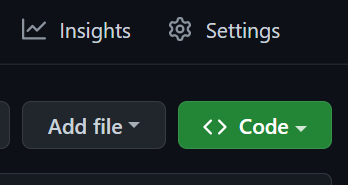
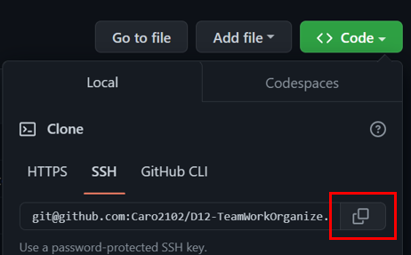

# D12-TeamWorkOrganize
Aplicación para poder ver y gestionar los departamentos, roles y empleados de mi empresa, para organizar y planificar mi negocio.

---
  ## Contenido
  1. [Enlaces](#enlaces)
  2. [Instalación](#instalación)
  3. [Uso](#uso)
  4. [Contribución](#contribución)
  
---
## Enlaces

**[Funcionalidad de la aplicación ](https://youtu.be/dD0EOeLF5dw "click")**.

**[URL de repositorio de GitHub](https://github.com/Caro2102/D12-TeamWorkOrganize "click")**.

---
  ## Instalación
- Clonar repositorio
    - Abrir el siguiente link **[URL de repositorio de GitHub](https://github.com/Caro2102/D12-TeamWorkOrganize "click")**.
    - Hacer click en <> Code.

        
    - Copiar la direccion URL del repositorio.

        
    - Abrir GitBash.
    - Ir a la ubicacion en donde quieres clonar el repositorio.
    - Escribir **`git clone`** y pegar la url antes copiada.
    - Presionar enter para clonar.

- Instalar node desde la pagina oficial **[NodeJS web Oficial](https://nodejs.org/es/ "click")**.
    - Abrir GitBash.
    - Ir a la ubicacion en donde se clonó el repositorio.
    - Escribir **`npm i`** para instalar las dependencias del proyecto.
    - Con esto instalaremos todas las dependecias que tengamos en el package.json y nos creará una carpeta llamada **node_modules** con las dependencias listas para utilizar.
    - Escribir **`mysql -u root -p`** para conectarse a MySQL CLI e igresar contraseña.
    - Escribir **`source schema.sql`** para crear la base de datos MySQL (Asegurarse que la ruta sea correcta).
    - Escribir **`source seeds.sql`** para popular la base de datos MySQL (Asegurarse que la ruta sea correcta).
    - Escribir **`npm start`** para ejecutar el archivo.

---
## Uso
 Ver **[video](https://youtu.be/dD0EOeLF5dw "click")** de funcionalidad para ver el uso de la aplicación.

---
## Contribución:
    
  Para contribuir con este proyecto:
- Fork del repositorio.
- Clonar el  repositorio.
- Actualizar la rama master.

        $git pull -r upstream master
- Crear rama.

        $ git checkout -b feature-nombre-rama
- Realizar cambios, agregarlos, hacer commit y despues hacer push hacia nuestro repositorio indicando la rama que hemos creado.

        $ git push origin feature-nombre-rama
- Hacer un Pull Request.
- Esperar que el codigo se acepte y se haga merge.

